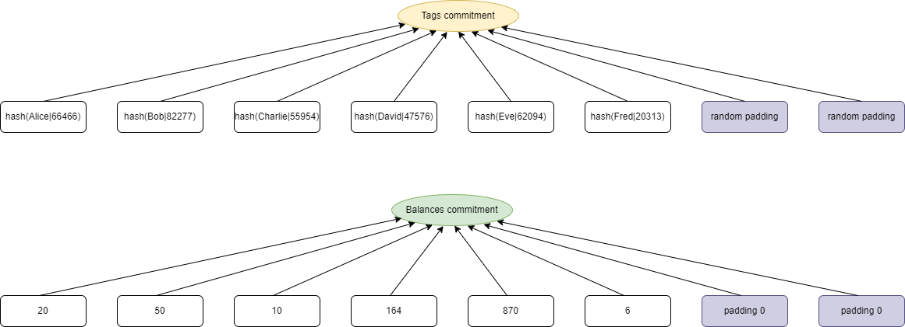
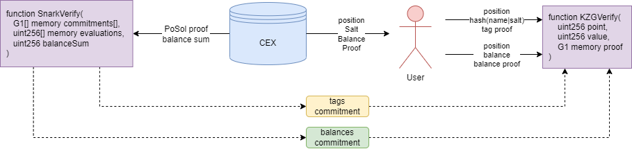

# PoSol — Proof of Solvency for Centralized Exchanges

> **This code is a concrete implementation of the document [Full Implementation of Proof of Solvency for CEX Based on Customized IOP](https://ethresear.ch/t/full-implementation-of-proof-of-solvency-for-cex-based-on-customized-iop/14596).** A local copy of the protocol document is available [here](./docs/Full%20Implementation%20of%20Proof%20of%20Solvency%20for%20CEX%20based%20on%20Customized%20IOP.md).

PoSol is a research prototype for proving a centralized exchange's aggregate user liabilities without publishing every user's account balance. It implements a customized interactive oracle proof (IOP), made non-interactive with Fiat–Shamir, over KZG polynomial commitments on the BN254 curve. The repository includes a Rust prover and verifier, a command-line simulator, and Solidity contracts for EVM verification and individual user checks.

## What the protocol proves

For a domain of size `n`, the exchange constructs two aligned vectors:

- `T`: user tags, where a tag is derived from a user identifier and salt;
- `B`: user balances, padded with zeroes to the domain size.

The vectors are interpolated as polynomials and committed independently with KZG. The balance-sum argument proves that the public value `m` is the sum of the committed balances. An auxiliary polynomial `S(X)` enforces the relation

```text
S(ωX) - S(X) = B(X) - m·L₀(X)    for every X in H,
```

where `H` is the evaluation domain, `ω` is its generator, and `L₀(X)` is the first Lagrange basis polynomial.

A Plookup-style range argument proves that every balance limb belongs to the table `{0, 1, …, n - 1}`. This prevents negative padding values from being used to reduce the declared total. Balances larger than the range can be represented with multiple base-`n` limbs and aggregated by the contract.

Finally, a user can obtain KZG openings for their tag and balance at the same domain position and verify that both values were included in the committed dataset.



## End-to-end flow

1. The exchange takes an account snapshot and places each user's tag and balance at the same index.
2. The prover commits to the tag and balance polynomials and generates a proof for the public balance sum.
3. The verifier checks the Fiat–Shamir transcript, polynomial constraints, range argument, and batched KZG openings.
4. The verified sum and commitments can be recorded by the Solidity contract.
5. A user requests the openings for their index and checks their tag and balance against the on-chain commitments.



## Repository layout

| Path | Description |
| --- | --- |
| [`core/`](./core) | Rust implementation of tag commitments, the balance-sum IOP, KZG openings, and verification. |
| [`bin/`](./bin) | CLI for generating sample users, creating KZG parameters, proving a balance sum, and producing individual openings. |
| [`contracts/`](./contracts) | Solidity verifier, BN254/KZG libraries, Hardhat tests, and deployment scripts. |
| [`docs/`](./docs) | Protocol specification, design notes, diagrams, benchmarks, and gas measurements. |

## Rust status

- **Tests:** 7 passed, 0 failed, 0 ignored — **100% pass rate**
- **Source:** 15 Rust files, 2,509 physical lines

The test pass rate is not a code-coverage percentage.

## Getting started

### Prerequisites

- A recent Rust toolchain with Cargo
- Node.js and Yarn for the Solidity project

The Rust crates are separate manifests rather than members of a root Cargo workspace, so commands should use `--manifest-path` as shown below.

### Run the Rust tests

```bash
cargo test --manifest-path core/Cargo.toml
cargo test --manifest-path bin/Cargo.toml
```

### Try the CLI locally

The following example uses a deliberately small domain. `--domain-size` must be a power of two, the number of users must not exceed it, and each generated balance is less than the domain size.

```bash
mkdir -p /tmp/posol-demo

cargo run --manifest-path bin/Cargo.toml -- gen-users \
  --domain-size 16 \
  --users-size 8 \
  --users-path /tmp/posol-demo/users.json

cargo run --manifest-path bin/Cargo.toml -- setup-kzg \
  --domain-size 16 \
  --ck-path /tmp/posol-demo/ck.bin \
  --cvk-path /tmp/posol-demo/cvk.bin

cargo run --manifest-path bin/Cargo.toml -- prove-and-commit \
  --domain-size 16 \
  --ck-path /tmp/posol-demo/ck.bin \
  --cvk-path /tmp/posol-demo/cvk.bin \
  --users-path /tmp/posol-demo/users.json \
  --witness-path /tmp/posol-demo/witness.bin

cargo run --manifest-path bin/Cargo.toml -- supply-witness \
  --domain-size 16 \
  --user-index 0 \
  --ck-path /tmp/posol-demo/ck.bin \
  --cvk-path /tmp/posol-demo/cvk.bin \
  --users-path /tmp/posol-demo/users.json \
  --witness-path /tmp/posol-demo/witness.bin
```

`prove-and-commit` verifies the generated balance-sum proof locally before printing the tag commitment, proof, and public sum. `supply-witness` generates and locally verifies the selected user's tag and balance openings.

The `setup-kzg` command generates parameters with a locally sampled secret and is suitable only for development. A production deployment must use an appropriately generated trusted setup.

### Build and test the contracts

```bash
cd contracts
yarn install
yarn hardhat compile
yarn hardhat test
```

`PoSolVerifier` supports asset registration, balance-sum proof verification, storage of timestamped commitments, and read-only verification of an individual user's tag and balance openings. See [`contracts/README.md`](./contracts/README.md) for contract data formats and the recorded gas benchmark.

## Implementation notes

- Cryptographic primitives are implemented with the Arkworks 0.3 ecosystem.
- KZG commitments and the Solidity verifier use the BN254 pairing curve.
- Fiat–Shamir challenges are derived from a Merlin transcript in Rust, with matching transcript logic in Solidity.
- The default Rust feature set enables parallel computation through Rayon.
- The protocol's full proving and verification equations are documented in the [English specification](./docs/Full%20Implementation%20of%20Proof%20of%20Solvency%20for%20CEX%20based%20on%20Customized%20IOP.md).

## Security and scope

This repository is an unaudited proof of concept. The protocol and its Rust and Solidity implementations require independent cryptographic and security audits before production use.

The implemented proof establishes properties of the exchange's committed user-liability dataset: the declared balance sum, balance range constraints, and individual inclusion. It does **not**, by itself, prove ownership or control of reserve assets, the completeness of the exchange's account snapshot, or a sufficient reserve-to-liability ratio. A complete proof-of-solvency system must combine this liability proof with independently verifiable reserve attestations and a trustworthy snapshot process.

## License

This project is licensed under the [MIT License](./LICENSE).
