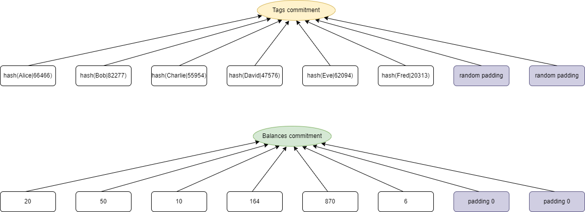
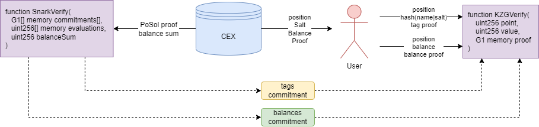

# Full Implementation of Proof of Solvency for CEX based on Customized IOP

## Background

Hi all, we have been studying Proof of Solvency (PoSol) since last month for our centralized exchange (CEX), relying on ZK-SNARKs but not third party auditing. Inspired by the [nice post](https://vitalik.ca/general/2022/11/19/proof_of_solvency.html) written by @vbuterin, we decided to refind it and draft a tentative instance of a customized IOP implementation of PoSol mentioned in the post.

`hash(username, salt)` is an exclusive tag to each user, construct a vector filled with all users' tags and commit it, which means each user's position slot has been confirmed. Similarly we construct a balances vector, where all elements are listed in the order of tag vector. (We think saperately committing is better than combining them into a single vector, as CEXs usually own millions of even billions of users, forcing us to minimize the vector's length to fit size of FFT domain).

After CEX has submitted a validated `total balance` with `Tag Commitment` and `Balance Commitment` on blockchain, user can calculate and verify his own `balance` by himself under a KZG polynomial commitment scheme. with given `position value`, `salt`, `tag proof` and `balance proof` from CEX.

## Circuit

Consider $\mathbb{F}$ a finite field of prime order. For a given integer $n$ ($n$ should be greater than number of users), denote by $N=\left \{0,1,...,n-1 \right \}$. Define the multiplicative subgroup $H=\left \{ 1,\omega ,\omega^2,...,\omega^{n-1} \right \}$ as the subgroup containing the $n$ roots of unity in $\mathbb{F}$, where $\omega$ is a n-th root of unity and a generator of $H$.

Define $T={\left \{ t_0,t_1,t_2,...,t_{n-1} \right \}}$ as users' tags vector of size $n$. (use zeros to take up remaining slots). Define $B=\left \{b_0,b_1,b_2,...,b_{n-1}\right \}$ as users' balances vector of size $n$. (use zeros to take up remaining slots).

Consider $S=\left \{s_0,s_1,s_2,...,s_{n-1}\right \}$ as an auxiliary vector. Shift left one unit for each element of $S$ in loop, we get $S'=\left \{s_1,s_2,...,s_{n-1},s_0 \right \}$. Define a constant vector $L_0=\left \{ 1,0,...,0 \right \}$. Note that if we force $S'-S=B-m\cdot L_0$ at the vector level,  whatever elements in $S$ are, it must satisfy $m=\sum_{i=0}^{n-1}b_i$, which is the balance sum that we want to declare.

Now we can construct a instance for $S$ as $S=\left \{\sum_{i=0}^{n-1}b_i,b_0,b_0+b_1,...,\sum_{i=0}^{n-2}b_i\right \}$, which satisfying $S'-S=B-m\cdot L_0$. That's an entrypoint for us to build a PoSol proving scheme.

## Polynomial Format

Denote by $f(X)\in\mathbb{F}_{\le l}[X]$ that degree of polynomial $f(X)$ over $\mathbb{F}$ is no more than $l$. Define the i-th Lagrange polynomial $L_i(X)\in\mathbb{F}_{\le n}[X]$, where $i \in N$. Define vanishing polynomial $Z_H(X)=\prod_{i=0}^{n-1}(X-\omega^i)=X^n-1$.

Transform $T$, $B$ and $S$ to polynomials by inverse FFT over $H$, we got $T(X)$, $B(X)$ and $S(X)$, and $S'$ corresponds to $S(\omega X)$. Moreover, consider the first Lagrange polynomial $L_0(X)$, which has the property of taking value $1$ at $x=1$ while taking value $0$ at any other elements in $H$. According to the above discussion, we have a polynomial equation at all elements in $H$:

$$
S(\omega X)-S(X)=B(X)-m\cdot L_0(X), \ X\in H
$$

We can write this more reasonably as a polynomial division format:

$$
Z_H(X) \ | \ S(\omega X)-S(X)-B(X)+m\cdot L_0(X)
$$

## Range Constraint

The CEX could set remaining elements in $B$ negtive (because no one can check these special padding balances) to reduce the declared balance sum $m$ and be evil. That's why vitalik says there needs a non-negative proof. Hereby we give a brief introduction to an elegant solution for continuous ranges proposed in Plookup protocol.

Define $t=\left\{0,1,2,...,n-1\right\}$ as a lookup-table vector. Suppose each balance is less than $n$ (If balance exceeds $n$, we can split into multiple $n$-decimal representations for repeating), then we just need to prove each element in $B$ can be found in $t$.

Let $V=\left \{v_0,v_1,...,v_{2n-1} \right\}$ be the vector that combines $(B, t)$ and sorted by $t$. Denote by $h_1=\left \{v_0,v_1,...,v_{n-1}\right\}$ and $h_2=\left \{v_n,v_{n+1},...,v_{2n-1}\right\}$. $h_1$ and $h_2$ can be constrained as following:

- Elements in $h_1$ must increase step by either $0$ or $1$.
- Elements in $h_2$ must increase step by either $0$ or $1$.
- The first value in $h_1$ must be 0.
- The last value in $h_2$ must be $n-1$.
- The first value in $h_2$ is either $0$ or $1$ greater than the last value in $h_1$.

Then we just need to prove all elements in $B$ and $t$ are completely as same as those in $h_1$ and $h_2$, while using a permutation constraint mentioned in Plookup.

## Protocol

With the above preparation work, we describe a similar protocol based on KZG commitment referred to the Plonk protocol creation process.

### Common Referenced String

$$
n
\\
\left \{[1]_1, [X]_1, [X^2]_1, ..., [X^{n+3}]_1 \right \},\ [X]_2
\\
t=\left \{0,1,2,...,n-1\right\}
\\
\left[t(X)\right]_1
$$

### Proving Process

We use `transcript` for obtaining random challenges via Fiat-Shamir. Initialize `transcript` with $n$.

#### Round 0

- Compute tags polynomial commitment $[T(X)]_1$.
- Compute balances sum of all users in field $\mathbb{F}$, denote by $m \in \mathbb{F}$ as a public input. Append it into `transcript`.

#### Round 1

- Generate random blinding scalars $a_0,a_1,...,a_4 \in \mathbb{F}$.
- Compute blinded balance representation polynomial $B(X) \in \mathbb{F}_{\le n+1}[X], \ i<k$:
$$
B(X)=(a_1X+a_0)Z_H(X)+\sum_{i=0}^{n-1}b_iL_i(X)
$$
- Compute blinded auxilary polynomial $S(X) \in \mathbb{F}_{\le n+2}[X]$:
$$
S(X)=(a_4X^2+a_3X+a_2)Z_H(X)+\sum_{i=0}^{n-1}s_iL_i(X)
$$
- Compute $[B(X)]_1$ and $[S(X)]_1$. Append them into `transcript`.

#### Round 2

- Generate random blinding scalars $c_0,c_1,...,c_5 \in \mathbb{F}$. Compute blinded polynomials $h_1(X) \in \mathbb{F}_{\le n+2}[X]$, $h_2(X) \in \mathbb{F}_{\le n+2}[X]$:
$$
h_1(X)=(c_2X^2+c_1X+c_0)Z_H(X)+\sum_{i=0}^{n-1}v_iL_i(X)
\\
h_2(X)=(c_5X^2+c_4X+c_3)Z_H(X)+\sum_{i=n}^{2n-1}v_iL_i(X)
$$
- Compute $h_1(X)$ and $h_2(X)$. Append them into `transcript`.

#### Round 3

- Compute the permutation challenge $\gamma \in \mathbb{F}$.
$$
\gamma=\mathrm{Hash(transcript)}
$$
- Generate random blinding scalars $d_0,d_1,d_2 \in \mathbb{F}$. Compute permutation polynomial $z(X) \in \mathbb{F}_{\le n+2}[X]$:
$$
\begin{aligned}
z(X)=&(d_2X^2+d_1X+d_0)Z_H(X)+L_0(X)
\\
&+\sum_{i=0}^{n-2}L_{i+1}(X)\prod_{j=0}^{i}\frac{(\gamma+b_j)(\gamma+t_j)}{(\gamma + v_j)(\gamma + v_{n+j})}
\end{aligned}
$$
- Compute $[z(X)]_1$. Append it into `transcript`.

#### Round 4

- Compute the quotient challenge $\delta \in \mathbb{F}$.
$$
\delta=\mathrm{Hash(transcript)}
$$
- Combine all of the polynomial constrains and compute the quotient polynomial $q(X) \in \mathbb{F}_{\le 2n+6}[X]$:
$$
q(X)=\frac{1}{Z_H(X)}
\left(
\begin{aligned}
&S(\omega X)-S(X)+mL_0(X)-B(X)
\\
&+z(X)(\gamma+B(X))(\gamma+t(X))\delta
\\
&-z(\omega X)(\gamma + h_1(X))(\gamma + h_2(X))\delta
\\
&+\left(z(X)-1\right)L_0(X)\delta^2
\\
&+\left(h_1(\omega X)-h_1(X)\right)\left(h_1(\omega X)-h_1(X)-1\right)(L_{n-1}(X)-1)\delta^3
\\
&+\left(h_2(\omega X)-h_2(X)\right)\left(h_2(\omega X)-h_2(X)-1\right)(L_{n-1}(X)-1)\delta^4
\\
&+\left(h_2(\omega X)-h_1(X)\right)\left(h_2(\omega X)-h_1(X)-1\right)L_{n-1}(X)\delta^5
\\
&+h_1(X)L_0(X)\delta^6
\\
&+\left(h_2(X)-n+1\right)L_{n-1}(X)\delta^7
\end{aligned}
\right)
$$
- Split $q(X)$ into 2 polynomials $q_0'(X)\in \mathbb{F}_{\le n+2}[X]$, $q_1'(X)\in \mathbb{F}_{\le n+3}[X]$, such that
$$
q(X)=q_0'(X)+X^{n+3}q_1'(X)
$$
- Generate random blinding scalars $e_0 \in \mathbb{F}$. Computed blinded polynomials $q_0(X)$, $q_1(X)$:
$$
\begin{aligned}
q_0(X)&=q_0'(X)+e_0X^{n+3}
\\
q_1(X)&=q_1'(X)-e_0
\end{aligned}
$$
- Compute $[q_0(X)]_1$ and $[q_1(X)]_1$. Append them into `transcript`.

#### Round 5

- Generate the evaluation challenge $z \in \mathbb{F}$.
$$
z=\mathrm{Hash(transcript)}
$$
- Compute the opening evaluations and append them into `transcript`:
$$
B(z),t(z),h_1(z),h_2(z)
\\
S(\omega z),z(\omega z),h_1(\omega z),h_2(\omega z)
$$

#### Round 6

- Generate opening challenge $\eta \in \mathbb{F}$.
$$
\eta=\mathrm{Hash(transcript)}
$$
- Compute linearization polynomial $r(X)\in \mathbb{F}_{\le n+3}[X]$:
$$
\begin{aligned}
r(X)=&S(\omega z)-S(X)+mL_0(z)-B(X)
\\
&+z(X)(\gamma+B(z))(\gamma+t(z))\delta
\\
&-z(\omega z)(\gamma + h_1(z))(\gamma + h_2(X))\delta
\\
&+\left(z(X)-1\right)L_0(z)\delta^2
\\
&+\left(h_1(\omega z)-h_1(X)\right)\left(h_1(\omega z)-h_1(z)-1\right)(L_{n-1}(z)-1)\delta^3
\\
&+\left(h_2(\omega z)-h_2(X)\right)\left(h_2(\omega z)-h_2(z)-1\right)(L_{n-1}(z)-1)\delta^4
\\
&+\left(h_2(\omega z)-h_1(X)\right)\left(h_2(\omega z)-h_1(z)-1\right)L_{n-1}(z)\delta^5
\\
&+h_1(X)L_0(z)\delta^6
\\
&+\left(h_2(X)-n+1\right)L_{n-1}(z)\delta^7
\\
&-Z_H(z)\left (q_0(X)+z^{n+3}q_1(X) \right)
\end{aligned}
$$
- Compute the opening proof polynomial $W_z(X)\in \mathbb{F}_{\le n+2}[X]$
$$
W_z(X)=\frac{1}{X-z}
\left(
\begin{aligned}
&r(X)
\\
&+\eta\left(B(X)-B(z)\right)
\\
&+\eta^2\left(t(X)-t(z)\right)
\\
&+\eta^3\left(h_1(X)-h_1(z)\right)
\\
&+\eta^4\left(h_2(X)-h_2(z)\right)
\end{aligned}
\right)
$$
- Compute the opening proof polynomial $W_{\omega z}(X)\in \mathbb{F}_{\le n+2}[X]$
$$
W_{\omega z}(X)=\frac{1}{X-\omega z}
\left(
\begin{aligned}
&S(X)-S(\omega z)
\\
&+\eta\left(z(X)-z(\omega z)\right)
\\
&+\eta^2\left(h_1(X)-h_1(\omega z)\right)
\\
&+\eta^3\left(h_2(X)-h_2(\omega z)\right)
\end{aligned}
\right)
$$
- Compute $[W_z(X)]_1$ and $[W_{\omega z}(X)]_1$.

Now we have the complete proof:
$$
\pi_{PoSol}=\left \{
\begin{matrix}
[B(X)]_1,[S(X)]_1
\\
[z(X)]_1,[h_1(X)]_1,[h_2(X)]_1
\\
[q_0(X)]_1,[q_1(X)]_1
\\
[W_z(X)]_1,[W_{\omega z}(X)]_1
\\
B(z),t(z),h_1(z),h_2(z)
\\
S(\omega z),\ z(\omega z),\ h_1(\omega z),\ h_2(\omega z)
\end{matrix}
\right \}
$$
Send both the public input $m$ and the proof $\pi_{PoSol}$ to the verifier.

### Verifying Process

#### Verify

- Validate $m$ and all elements in $\pi_{PoSol}$ are valid.
- Compute challenges $\delta,\ z,\ \eta \in \mathbb{F}$ via `transcript` as in the prover’s algorithm description, with $m$ and elements in $\pi_{PoSol}$.
- Compute the vanishing polynomial evaluation $Z_H(z)=z^n-1$.
- Compute the first Lagrange polynomial evaluation $L_0(z)=\frac{z^n - 1}{n(z - 1)}$.
- Compute the last Lagrange polynomial evaluation $L_{n-1}(z)=\frac{\omega^{n-1}(z^n - 1)}{n(z - \omega^{n-1})}$.
- Compute opening point evaluation $p$:
$$
\begin{aligned}
p=&S(\omega z)+mL_0(z)-z(\omega z)(\gamma+h_1(z))\gamma\delta-L_0(z)\delta^2
\\
&+h_1(\omega z)\left(h_1(\omega z)-h_1(z)-1\right)(L_{n-1}(z)-1)\delta^3
\\
&+h_2(\omega z)\left(h_2(\omega z)-h_2(z)-1\right)(L_{n-1}(z)-1)\delta^4
\\
&+h_2(\omega z)\left(h_2(\omega z)-h_1(z)-1\right)L_{n-1}(z)\delta^5
\\
&+(1-n)L_{n-1}(z)\delta^7
\\
&-\eta B(z)-\eta^2t(z)-\eta^3h_1(z)-\eta^4h_2(z)
\end{aligned}
$$
- Compute polynomial commitments combination $[P]_1$:
$$
\begin{aligned}
[P]_1=&-[S(X)]_1
\\
&+(\eta-1)\cdot[B(X)]_1
\\
&+\left((\gamma+B(z))(\gamma+t(z))\delta+L_0(z)\delta^2\right)\cdot[z(X)]_1
\\
&+\eta^2\cdot[t(X)]_1
\\
&+\left(
\begin{aligned}
&-\left(h_1(\omega z)-h_1(z)-1\right)(L_{n-1}(z)-1)\delta^3
\\
&-\left(h_2(\omega z)-h_1(z)-1\right)L_{n-1}(z)\delta^5
\\
&+L_0(z)\delta^6
\\
&+\eta^3
\end{aligned}
\right)\cdot[h_1(X)]_1
\\
&+\left(
\begin{aligned}
&-z(\omega z)(\gamma + h_1(z))\delta
\\
&-\left(h_2(\omega z)-h_2(z)-1\right)(L_{n-1}(z)-1)\delta^4
\\
&+L_{n-1}(z)\delta^7
\\
&+\eta^4
\end{aligned}
\right)\cdot[h_2(X)]_1
\\
&-Z_H(z)\cdot[q_0(X)]_1
\\
&-z^{n+3}Z_H(z)\cdot[q_1(X)]_1
\\
\end{aligned}
$$
- Compute opening point evaluation $u$:
$$
u=-S(\omega z)-z(\omega z)\eta-h_1(\omega z)\eta^2-h_2(\omega z)\eta^3
$$
- Compute polynomial commitments combination $[U]_1$:
$$
[U]_1=[S(X)]_1+\eta\cdot[z(X)]_1+\eta^2\cdot[h_1(X)]_1+\eta^3\cdot[h_2(X)]_2
$$
- Verify KZG opening proof by pairing engine $e([\bullet]_1,[\bullet]_2)$:
$$
\begin{aligned}
e([W_z(x)]_1,[x]_2)&\overset{?}{=}e([P]_1+p\cdot[1]_1+z\cdot[W_z(x)]_1,[1]_2)
\\
e([W_{\omega z}(x)]_1,[x]_2)&\overset{?}{=}e([U]_1+u\cdot[1]_1+\omega z\cdot[W_{\omega z}(x)]_1,[1]_2)
\end{aligned}
$$

## Remark

Confined to limitations of our understanding on cryptography and ZKSNARK, if there are any mistakens or defects, please point out or give us some suggestions.

If there are no bugs in the protocol, we will open source the implementation code as soon as possible, thanks!
