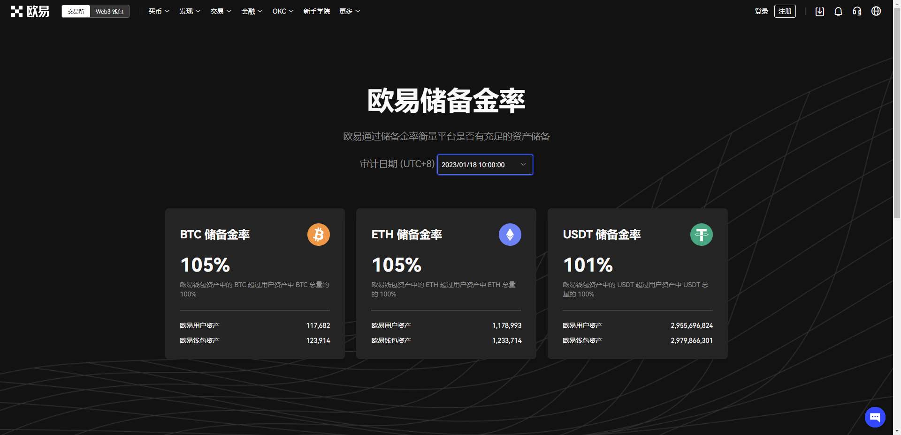
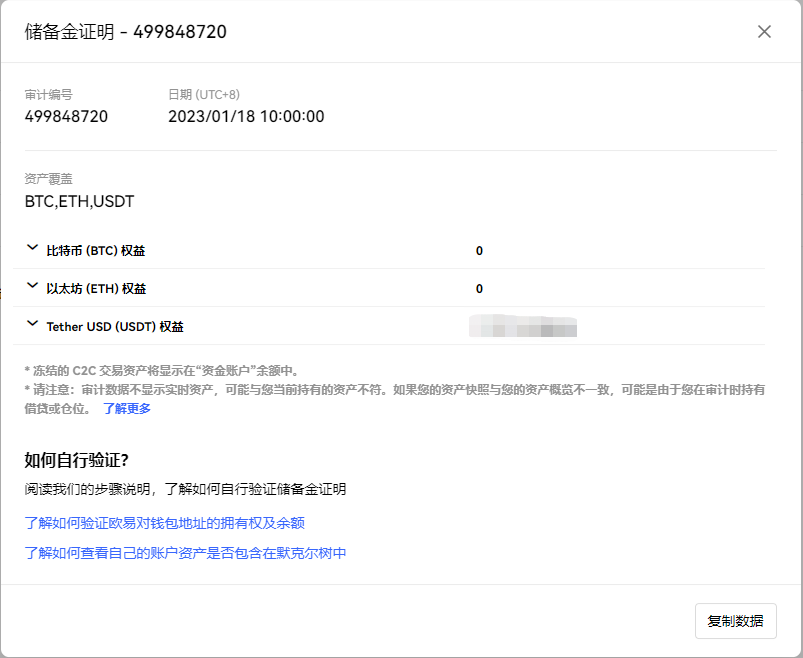
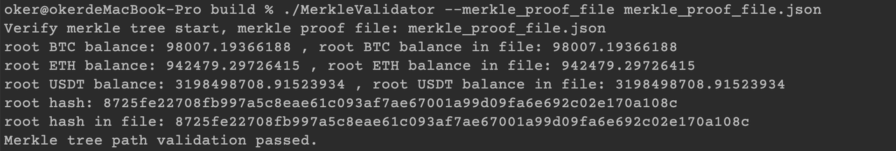
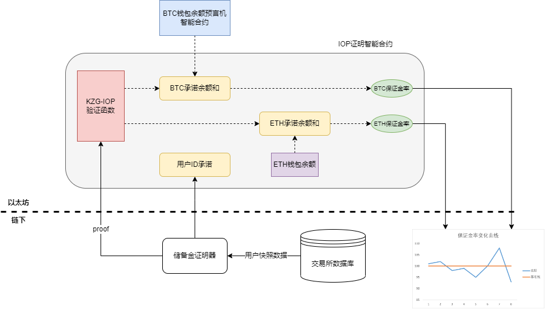
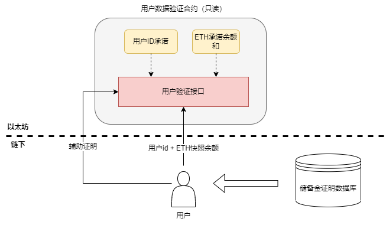

# 基于自定义IOP的交易所偿付能力证明方案PoC

|文档版本|协议版本|日期|更改点|作者|
|-|-|-|-|-|
|v0.1|v0|2023/02/06|初版|Yunlong Ge|
|v0.2|v0|2023/01/30|加入了合约GAS开耗|Yunlong Ge|

---

[toc]

## 背景

在2022年11月的知名交易所FTX因擅自挪用用户资产事件曝光后，目前各大主流交易所都公开了自己的储备金证明（Proof of Solvency）计划。即定时对外公开交易所的储备资产/保证金率，同时允许所有用户自查，以确保交易所拥有足够的基金储备以随时应对用户提现。
目前各大主流交易所的储备金证明计划：

- Binance：已上线审计版，同时正在推出新的基于零知识证明的证明协议
- OKX：已上线审计版
- Kraken：已上线审计版
- Huobi：即将上线审计版
- Bybit：即将上线审计版
- Coinbase：没有计划，但Coinbase有自己的定期数据披露方案

## 现有方案

### 第三方审计

交易所需要向第三方审计平台提供用户全量资产快照信息以及交易所的储备金钱包地址，第三方审计公司会计算用户资产的总和与储备金钱包地址的余额之比，得到交易所对应资产的储备金率。以OKX为例：OKX会每隔1~2个月通过第三方审计公司公布BTC、ETH、USDT三种代币的资金储备情况。第三方审计公司计算出储备金率，并将所有用户数据组织成为Merkle Tree，并公布Merkle Root。

<div align=center>

</div>

- 在用户端用户可以看到每次审计时自己的账户快照余额。用户可以自行确认在对应的时间点自己的账户余额是否匹配。

<div align=center>

</div>

- 用户通过下载一个[开源工具](https://www.okx.com/support/hc/zh-cn/articles/10660988139661)来验证自己的快照数据与承诺时的Merkle Root是否匹配，从而来让用户相信交易所没有造假用户数据。

<div align=center>

</div>

- 此外，用户可以[下载工具](https://www.okx.com/support/hc/zh-cn/articles/10781041719437)验证快照点的钱包余额是否与声明余额匹配，从而证明交易所的钱包没有造假。

该方案是目前大部分交易所的普便采用方案，但存在较多的问题：

1. 需要用户完全信赖第三方审计公司（包括审计方正确计算用户资金总和，不泄露用户数据隐私等）。
2. 与第三方审计机构合作，效率低下，无法做到每日/每周证明。（存在交易所向外短期借款以应付储备金证明）。
3. 用户需要下载名目繁多的工具，进行一系列的复杂操作才能自我验证。对用户不够友好，从某种程度上讲用户根本不会去做自我验证。

### 基于零知识证明的协议

零知识证明主要用来在不泄露数据隐私的情况下以去信任的方式解决一些计算问题，将用户对第三方审计方的信任转换为对密码学/数学的信任。在储备金证明问题中，我们需要证明的事情如下：

- 交易所声明的金额是把所有用户的余额相加得来的
- 任何用户都可以检查自己的余额与声明总额是匹配的

此外零知识证明的应用方式也是多样的，在以太坊创始人Vitalik的这篇[博客](https://vitalik.ca/general/2022/11/19/proof_of_solvency.html)中也有提及。
目前公开的方案中值得注意的是[p0xeidon-labs](https://foresightnews.pro/article/detail/14169)团队为币安设计的一种基于zk-stark的[储备金证明方案](https://hackmd.io/@p0xeidon-labs/S14s1Ipwi)。

该方案的roadmap如下：

- 2022年12月9日: 证明框架的设计
- 2022年12月31日：面向 2 亿用户的 Starky 证明原型
- 2023年1月: 计算过程硬件加速与benchmark测试
  - Prover time
  - Query time
  - USD/Query
- 2022年4月：生产实现

## 基于自定义KZG-IOP的设计实现

*IOP(Interactive Oracle Proof)是一种常见的零知识证明协议的设计方式，通过Fiat-Shammir算法与多项式随机检查相结合的零知识证明证明思路（著名的Plonk协议就是根据IOP设计完成的）。*

### 为什么要使用KZG-IOP

在vitalik的博客中提到的零知识证明实现思路即KZG-IOP，其中一个重要原因是我们需要对用户数据进行承诺(commit)。如果通过Merkle Tree来实现用户的承诺，我们需要在零知识证明证明中实现哈希和Merkle Tree的电路，增加了复杂度。但KZG-IOP中我们可以使用多项式承诺(Polynomial Commitment)实现承诺，避免了引入Merkle Tree计算，大大减小零知识证明的复杂度。这里我们基于KZG-IOP的思路完成的实现了整个证明框架，并对一些具体计算过程进行了优化改造。

### KZG-IOP方案的优点

- 证明数据大小：与p0xeidon-labs的方案对比，基于KZG-IOP的方案在交易所证明阶段更加简洁，证明数据更少（3 KB vs 3 MB）。
- 可实现链上验证：与p0xeidon-labs的方案对比，Starky方案在EVM上实现验证具有较高的难度，但本方案已经实现了在EVM上验证，从而可以在ETH/Avalanche等链上实现完整的验证逻辑。这意味着用户不再需要任何的第三方信任假设。（如果不能在链上验证证明，意味着需要用户自行验证零知识证明，依然存在某种程度的信任假设）

### KZG-IOP方案的潜在缺点

在p0xeidon-labs的方案中提到了他们认为的KZG-IOP的缺点包括如下：

- 可信设置：KZG-IOP方案中只需要Proof of Tau的可信设置，而且以太坊目前已经启动了以太坊自己的Proof of Tau设置，使用以太坊官方的可信参数即可。
- 计算开销：事实上KZG-IOP方案中比较耗时且有影响的部分只有用户query自己的witness数据（类似于用户向交易所请求自己的Merkle Path）过程。经过测试，在用户总数不超过10,000,000时用户query过程耗时为秒级，满足要求。
- 审计问题：由于IOP属于自定义零知识证明协议，因此需要第三方密码学对该协议进行全面审计。

## 方案框架

### 交易所向以太坊证明余额和

<div align=center>

</div>

- 交易所定期向`储备金证明器`发送用户账户ID与币种余额（以BTC+ETH为例）的快照数据
- `储备金证明器`生成IOP零知识证明证明，并将用户ID承诺与不同币种余额总和证明（包含余额和承诺）提交至链上
- 链上合约首先验证余额和证明是否正确，证明通过后根据交易所的储备金钱包余额计算各币种的**保证金率**。合约会将**保证金率**，**余额承诺**，**ID承诺**记录在链上。
- 对于ETH与ETH上的ERC20代币而言，智能合约内部可以直接读取到交易所指定的钱包余额，并计算出储备金率。对于非ETH资产，可以通过第三方预言机或跨链方案（Chainlink）向以太坊同步并记录其他链的交易所资产。
- 任何人都可以无信任的读取链上的不同时段的储备金率，从而相信交易所始终保持充足的偿付能力。

### 用户在链上验证自己的账户数据

<div align=center>

</div>

- 用户向交易所请求提供账户余额、账户ID和辅助证明（类似于Merkle Proof），并自行在链上智能合约上验证自己数据被包含在余额总和中，该过程中无需交易所提供或用户下载任何辅助工具。
- 链上合约会返回给用户结果，同时用户验证合约接口是只读的，用户不需要付出任何的手续费。

## 目前进度

- [x] 自定义IOP证明协议的设计
- [x] 证明/验证协议的rust核心代码实现
- [x] 证明/验证过程的unit testing + benchmark
- [x] 储备金证明器的原型开发
- [x] 证明验证合约与用户自查验证合约原型开发
- [ ] 证明协议的密码学审计（协议的安全性、正确性、健全性(Soundness)）
- [ ] 协议对应的代码审计（证明端代码 + 智能合约代码）
- [ ] 完整的方案制定（交易所快照 + 后端服务 + Dapp前端）

## 余额总和证明的算法实现

*见协议内容：Full Implementation of Proof of Solvency for CEX based on Customized IOP.*

## 性能开销与优化

### 硬件环境

|Architecture|CPU(s)|Thread(s) per core|Model name|Ram|Linux Core|
|:-:|:-:|:-:|:-:|:-:|:-:|
|x86_64|72|2|Genuine Intel(R) CPU 0000|256G|v5.4.0|

### 并行加速

- [x] 多线程
- [ ] GPU

### 性能开销

|分组|1|2|3|4|5|6|7|8|
|:-:|:-:|:-:|:-:|:-:|:-:|:-:|:-:|:-:|
|最大用户数/万|100|200|400|800|1600|3200|6400|13000|
|余额精度限制/bit|20|21|22|23|24|25|26|27|
|最大内存消耗/G|1|2|4|8|16|32|64|128|
|承诺密钥大小|65M|129M|257M|513M|1.1G|2.1G|4.1G|8.1G|
|见证数据大小|65M|129M|257M|513M|1.1G|2.1G|4.1G|8.1G|
|预计算耗时/s|0.86|1.7|3.5|6.9|13|27|58|120|
|承诺ID耗时/s|0.80|1.6|3.5|6.4|12|31|52|117|
|证明余额和耗时/s|16|34|71|145|292|604|1205|2411|
|为用户提供ID辅助证明耗时/s|0.94|1.8|3.9|7.7|16|31|63|120|
|为用户提供余额辅助证明耗时/s|0.85|1.8|4.2|7.2|15|32|63|119|

- 上表中只计算了性能开销，未考虑IO的影响
- 根据以太坊目前所支持的配对曲线Bn254限制，支持的用户上限为**1.3亿**
- 各性能指标呈指数关系增长
- 证明过程的总耗时（预计算部分可以考虑提前算好并加载到内存中）应为：**(预计算耗时) + 承诺ID耗时 + 证明余额和耗时 * Σ (币种精度bit / 余额精度限制)**
  - 假设交易所用户总数为1000万（第五组），支持BTC和ETH两个币种，BTC精度为32bit，ETH精度为64bit，则1-server证明的计算耗时 = 13 + 12 + 292 * (2 + 3) = 1485秒；若采用5-server并行计算耗时 = 13 + 12 + 292 = 317秒
- 为单个用户提供余额辅助证明的耗时应为：**为用户提供ID辅助证明耗时 + 为用户提供余额辅助证明耗时 * 用户查询的币种精度bit / 余额精度限制**
  - 假设交易所用户总数为1000万（第五组），用户查询的币种为BTC，且BTC精度为32bit，则1-server为用户提供辅助证明的耗时 = 16 + 15 * 2 = 46秒；若采用2-server并行计算耗时 = 16 + 15 = 31秒

### 用户query的性能优化

*由于计算用户总余额证明不需要面向用户，且频率较低，因此对证明部分进行优化的意义不大。但计算辅助证明的部分是面向用户的，因此该部分可能需要性能优化。*

```bash
Start:   Tag: Individual Opening
··Start:   Creating proof for polynomials
····Start:   Opening polynomial of degree 16777215
······Start:   Computing witness polynomials
········Start:   Computing witness polynomial
········End:     Computing witness polynomial ......................................2.852s
······End:     Computing witness polynomials .......................................2.852s
······Start:   Converting polynomial coeffs to bigints
······End:     Converting polynomial coeffs to bigints .............................53.377ms
······Start:   Computing commitment to witness polynomial
······End:     Computing commitment to witness polynomial ..........................12.126s
····End:     Opening polynomial of degree 16777215 .................................15.064s
··End:     Creating proof for polynomials ..........................................15.090s
End:     Tag: Individual Opening ...................................................15.959s
```

为用户提供辅助证明的计算主要来自一个多项式打开(Polynomial Opening)的过程，该部分分为**生成辅助多项式**和**承诺辅助多项式**两部分。以第五组(1600万用户规模)为例

- 计算辅助多项式（2.852s）：主要是进行快速傅里叶变换(FFT)计算，该部分已经完全实现并行化且耗时占比较短，因此无优化必要。
- 承诺辅助多项式（12.126s）：该部分主要是进行椭圆曲线MSM(Multi-scalar Multiplication)计算，该部分目前使用的arkworks团队开发的ark-ec库，实际中只用到了15线程。MSM目前已经已经有大量的[优化实现](https://hackmd.io/@tazAymRSQCGXTUKkbh1BAg/Sk27liTW9)，可以参考并进行进一步的并行优化，从而缩小MSM的计算耗时。

## 智能合约GAS开销

*只考虑验证证明过程的手续费消耗，未考虑链上写入等操作的GAS消耗。*

```bash
·----------------------------------------------|---------------------------|---------------|-----------------------------·
|             Solc version: 0.8.4              ·  Optimizer enabled: true  ·  Runs: 10000  ·  Block limit: 30000000 gas  │
···············································|···························|···············|······························
|  Methods                                                                                                               │
···························|···················|·············|·············|···············|···············|··············
|  Contract                ·  Method           ·  Min        ·  Max        ·  Avg          ·  # calls      ·  usd (avg)  │
···························|···················|·············|·············|···············|···············|··············
|  TestBalanceSumVerifier  ·  testVerifyProof  ·          -  ·          -  ·       334219  ·            1  ·          -  │
···························|···················|·············|·············|···············|···············|··············
|  Deployments                                 ·                                           ·  % of limit   ·             │
···············································|·············|·············|···············|···············|··············
|  TestBalanceSumVerifier                      ·          -  ·          -  ·      2870751  ·        9.6 %  ·          -  │
·----------------------------------------------|-------------|-------------|---------------|---------------|-------------·
```

证明验证需要耗费的GAS应为： **334219 * Σ (币种精度bit / 余额精度限制)**

- 假设交易所向链上验证了BTC和ETH两个币种的证明，BTC精度为32bit，ETH精度为64bit，则花费在验证部分的总GAS消耗 ≈ 334219 * (2 + 3) ≈ 1671095。若当前GAS价格为25GWei，则合约验证部分的手续费消耗为**0.041ETH**。
